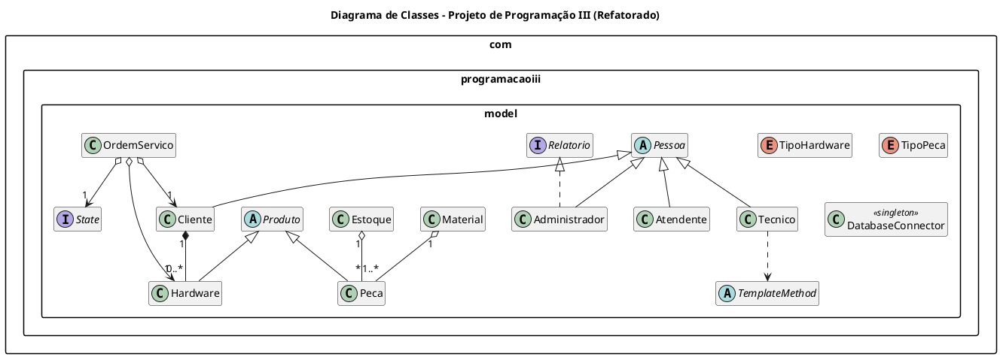

# Sistema de Gerenciamento de Ordens de Serviço ⚙️


<p align="center">
  <em>Um sistema robusto para gerenciamento de OS, desenvolvido com foco em Padrões de Projeto para garantir um código limpo, manutenível e escalável.</em>
</p>

---

## 📜 Índice

* [Visão Geral](#-visão-geral)
* [Arquitetura e Padrões de Projeto](#-arquitetura-e-padrões-de-projeto)
    * [State Pattern](#1-padrão-de-projeto-state)
    * [Template Method Pattern](#2-padrão-de-projeto-template-method)
    * [Singleton Pattern](#3-padrão-de-projeto-singleton)
* [Diagrama de Classes UML](#-diagrama-de-classes-uml)
* [Estrutura do Projeto](#-estrutura-do-projeto)
* [Como Utilizar](#-como-utilizar)

---

## 🎯 Visão Geral

Este projeto é uma solução completa para gerenciar o ciclo de vida de Ordens de Serviço (OS) em uma assistência técnica. Desenvolvido em **Java**, ele aplica conceitos avançados de engenharia de software para criar uma base de código modular e eficiente, separando responsabilidades entre diferentes atores do sistema:

| Ator            | Responsabilidades Principais                               |
| --------------- | ---------------------------------------------------------- |
| 👤 **Atendente** | Abrir e atualizar Ordens de Serviço.                       |
| 🛠️ **Técnico** | Realizar orçamentos, executar reparos e finalizar OS.      |
| 💼 **Admin** | Gerenciar OS (incluindo exclusão) e gerar relatórios.      |
| 🙋 **Cliente** | Aprovar orçamentos e acompanhar o status da OS.            |

---

## 🏛️ Arquitetura e Padrões de Projeto

A arquitetura do sistema foi cuidadosamente planejada sobre três Padrões de Projeto fundamentais:

### 1. Padrão de Projeto *State*

-   **🎯 Objetivo:** Gerenciar o fluxo de estados da `OrdemServico` (ex: `Aberta` -> `Aguardando Aprovação` -> `Em Reparo`).
-   **💡 Implementação:** A interface `State` e suas implementações concretas encapsulam o comportamento de cada estágio. A classe `OrdemServico` delega as ações para o seu estado atual, eliminando condicionais complexas e facilitando a adição de novos estados.

### 2. Padrão de Projeto *Template Method*

-   **🎯 Objetivo:** Definir um algoritmo padrão para o processo de reparo, garantindo consistência e permitindo que detalhes específicos sejam customizados.
-   **💡 Implementação:** A classe abstrata `TemplateMethod` define o esqueleto do processo (`diagnosticar` -> `reparar` -> `testar`). Subclasses como `ReparoNotebook` ou `ReparoCelular` implementam os passos específicos, garantindo que o fluxo principal seja sempre o mesmo.

### 3. Padrão de Projeto *Singleton*

-   **🎯 Objetivo:** Assegurar uma única instância da classe `DatabaseConnector`, centralizando o acesso ao banco de dados e economizando recursos.
-   **💡 Implementação:** A classe `DatabaseConnector` possui um construtor privado e um método estático `getInstance()` que controla o acesso à instância única, garantindo um ponto de acesso global e seguro para a conexão com o banco.

---

##  UML Diagrama de Classes UML

O diagrama abaixo ilustra a arquitetura completa do sistema, incluindo classes, relacionamentos e os padrões de projeto aplicados.

<details>
<summary>Clique para expandir e ver o código PlantUML</summary>



</details>

> **Dica:** Você pode gerar uma imagem a partir do código PlantUML acima (usando uma extensão do VS Code ou um site online) e inseri-la aqui para uma visualização direta: ``

---

## 📂 Estrutura do Projeto

Todo o código-fonte está contido no pacote `com.programacaoiii.model`. A estrutura separa claramente as responsabilidades, facilitando a navegação e o desenvolvimento.

---

## 🚀 Como Utilizar

### Pré-requisitos

-   **Java Development Kit (JDK) 11+**
-   Uma IDE de sua preferência (**Eclipse**, **IntelliJ IDEA**, **VS Code**)

### Compilando e Executando

1.  **Clone o repositório:**
    ```bash
    git clone [https://github.com/seu-usuario/seu-repositorio.git](https://github.com/seu-usuario/seu-repositorio.git)
    ```
2.  **Importe o projeto** na sua IDE como um projeto Java existente.

3.  **Crie uma classe `Main` para testar:** Como o projeto é focado no modelo de domínio, você pode criar uma classe de teste para ver o sistema em ação.

    ```java
    import com.programacaoiii.model.*;
    import java.time.LocalDate;

    public class Main {
        public static void main(String[] args) {
            // 1. Criando os atores
            Administrador admin = new Administrador(1, "Admin User", "111.111.111-11", LocalDate.now(), "Rua A");
            Cliente cliente = new Cliente(2, "Marcio", "222.222.222-22", LocalDate.of(1990, 5, 15), "Rua B");

            // 2. Cliente cadastra um hardware
            Hardware notebook = new Hardware(TipoPeca.PLACA_MAE, "SN12345", cliente);

            // 3. Admin abre uma nova Ordem de Serviço
            OrdemServico os = new OrdemServico(101, 0.0, "Notebook não liga", null, cliente, notebook, null, null);

            System.out.println("✅ Ordem de Serviço #" + os.getId() + " aberta para o cliente " + os.getCliente().getNome());
            System.out.println("📋 Problema relatado: " + os.getDescricao());
        }
    }
    ```